# 一、基本功能

```java
reference:
https://blog.csdn.net/m0_57787115/article/details/130296388
```


## 1、克隆仓库

```bash
git clone  https://github.com/Whitejun/DevEnvironment.git
```


## 2、添加和提交代码

使用`git commit`命令提交更改到本地仓库，并提供相关的提交说明

```bash
git commit -m "第一版提交测试"
```


## 3、推送代码

使用`git push`命令将本地仓库的代码推送到GitHub远程仓库。

```bash
git push origin main
```


# 二、Git 命令行

## 1、上传项目

```java
# 先提交到缓冲区
git add 'How to use Github.md'
# git commit将暂存区的项目提交到本地仓库，注意，该行为会被记录，-m后面加该行为的备注，以提示自己或他人。
git commit -m "我上传了第一个项目"

# git push用于将本地仓库的更改推送到远程仓库，也就是github官网上我们自己的仓库
git push origin main


```


## 2、如何将本地库的新文件推送到github上

```java
参考的博客：
https://blog.csdn.net/Jeffxu_lib/article/details/100726687?ops_request_misc=&request_id=&biz_id=102&utm_term=%E5%A6%82%E4%BD%95%E5%B0%86%E6%9C%AC%E5%9C%B0%E5%BA%93%E7%9A%84%E6%96%B0%E6%96%87%E4%BB%B6%E6%8E%A8%E9%80%81%E5%88%B0github%E4%B8%8A&utm_medium=distribute.pc_search_result.none-task-blog-2~blog~sobaiduweb~default-3-100726687.142^v99^pc_search_result_base3&spm=1018.2226.3001.4450
```


# 三、Git& github

##  2、使用github

### 2.1 目的

借助github托管项目代码

### 2.2 基本概念

#### **①  仓库（Repository）**

仓库用来存放项目代码，每个项目对应一个仓库，多个开源项目则有多个仓库

#### **②  收藏（Star）**

方便下次查看，100个star 是不容易了

#### **③  复制克隆项目（Fork）**


forked from 张三/test仓库

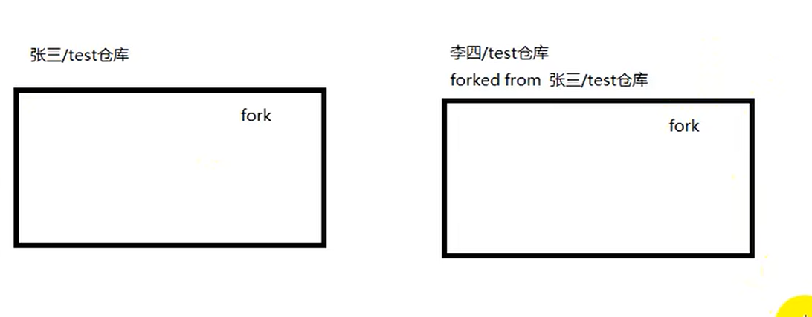

脚下留心： 该fork的项目是独立存在的


#### **④发起请求  Pull Request（）**

做了改动，提交给对方

等待张三查看，

感觉不错，合并到原仓库

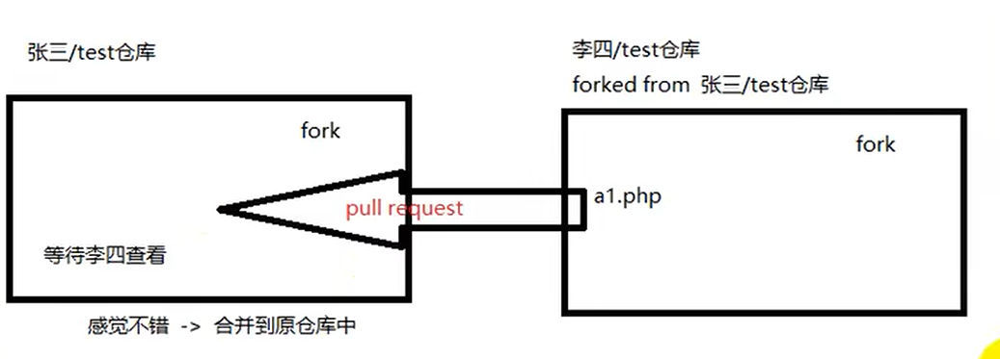

#### ⑤ watch

项目有任何的更新，关注者可以看到


#### ⑥ 事务卡片（issue）

发现代码bug，但是目前没有成型的代码，需要讨论


#### ⑦ github 主页

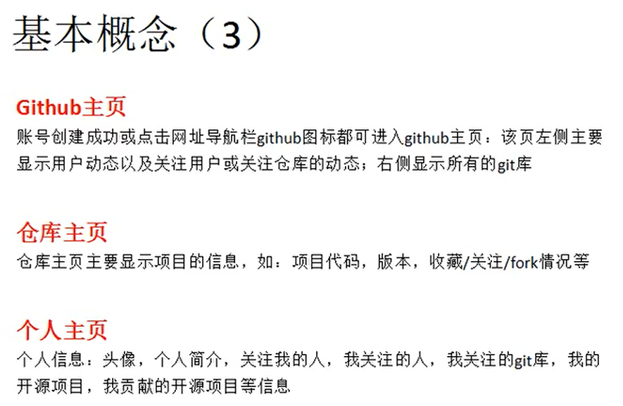

### 2.3  注册github账号

```java
1、官网：
   github.com
```

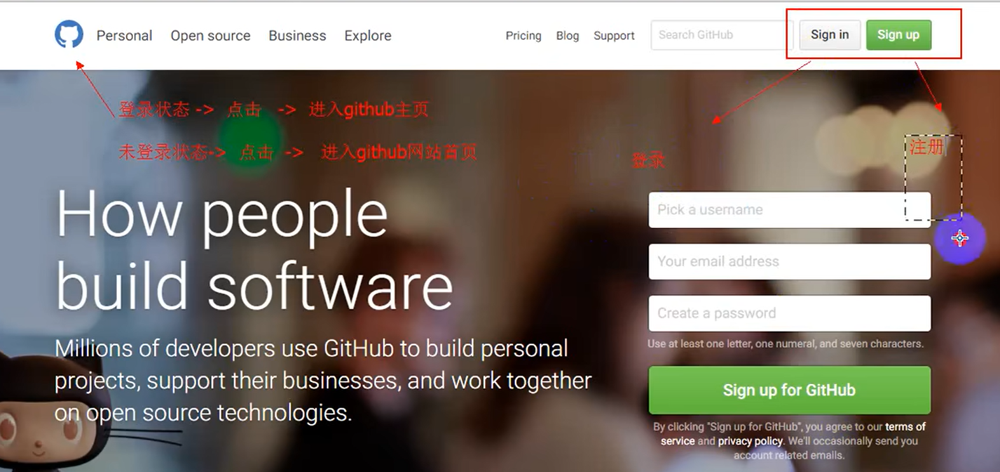


#### create your personal account


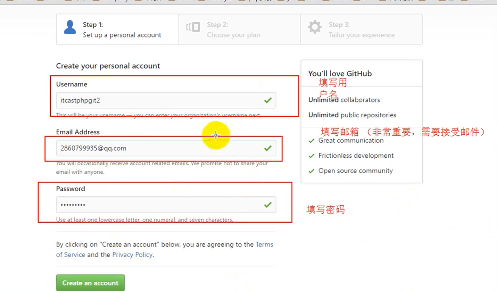

#### Free or Fee

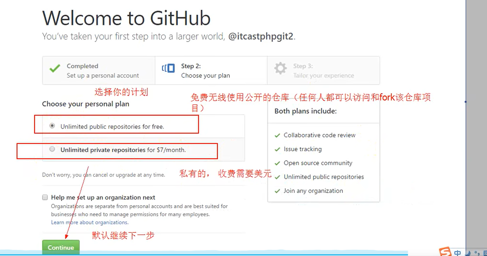

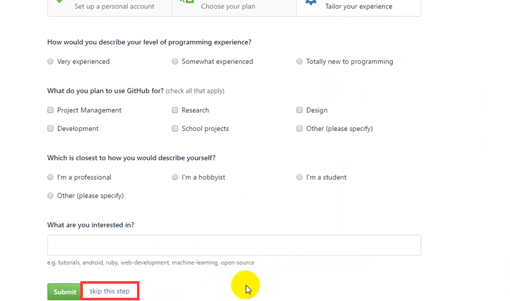

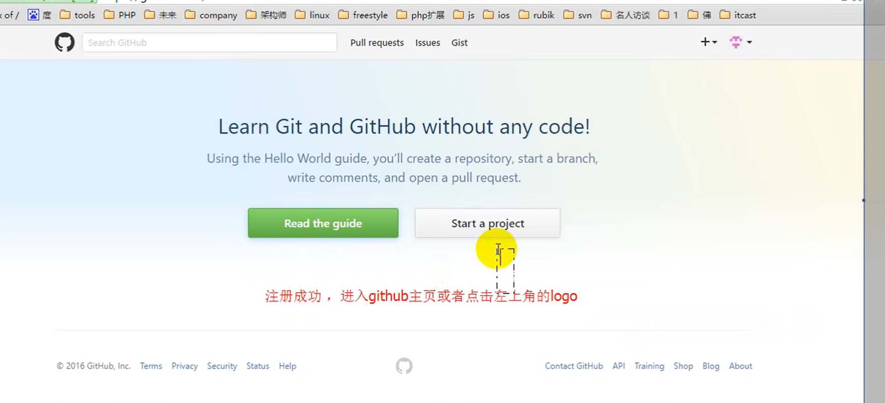

**脚下留心：**
	1、因为github是在国外服务器，访问较慢或者无法访问，需要翻墙（shadowsocks）

​	2、私有仓库只能自己或者指定的朋友才有权限（私有仓库是收费的）

​	3、新注册的用户必须要验证邮箱


### 2.4 创建一个仓库/项目


#### 说明

一个git库（仓库），对应一个开源项目

通过git管理git库


#### 脚下留心

未设置QQ邮箱白名单，才可以收到邮件

设置QQ邮箱的白名单

```java
打开qq邮箱-- 点击设置-反垃圾-设置域名白名单--添加到域名白名单
github.com
白名单即可
```

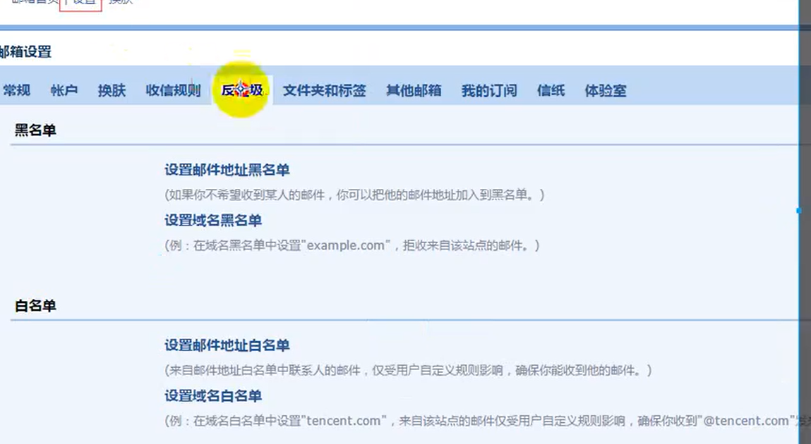


#### 创建仓库

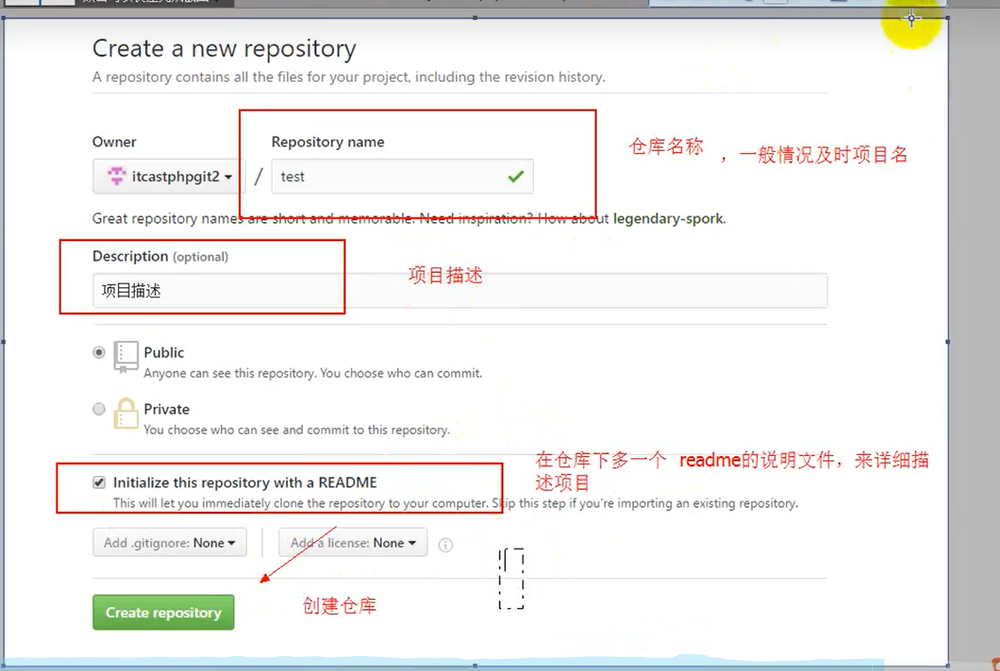


#### 仓库主页说明

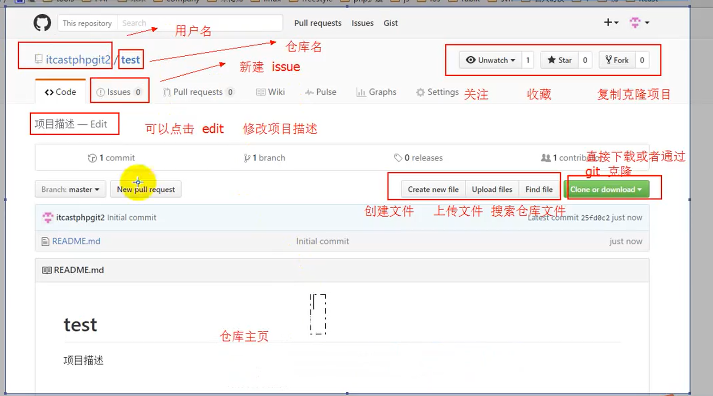


### 2.5 仓库的管理

##### ① 新建文件

create new file

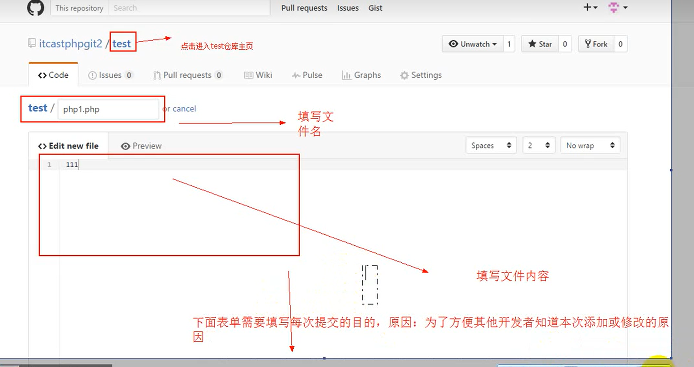

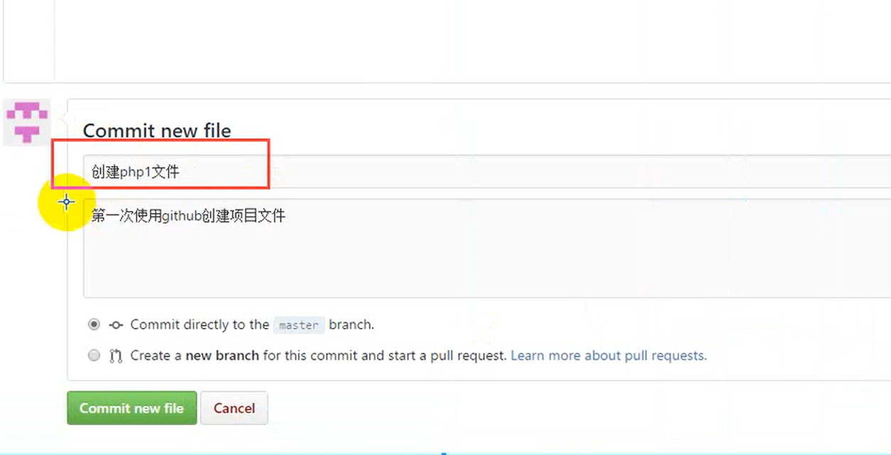

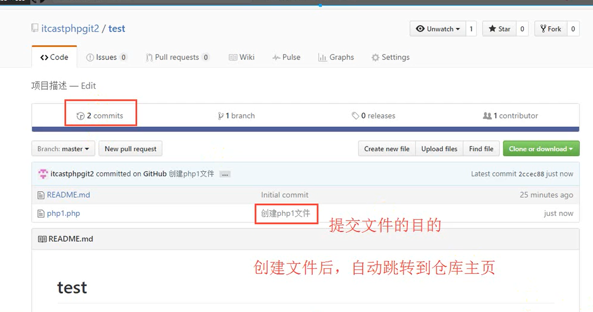


##### ② 编辑文件

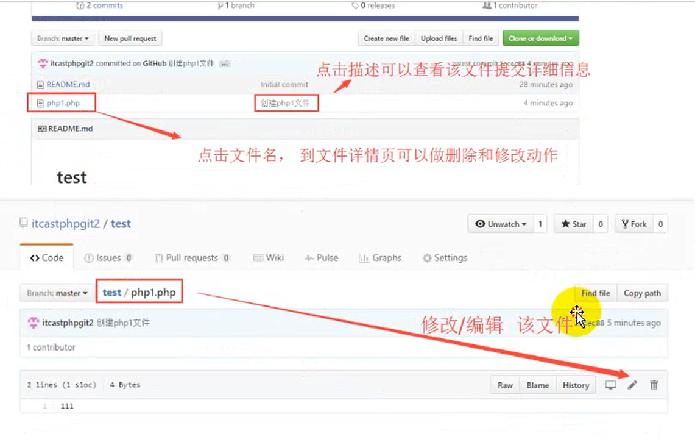

##### ③ 删除文件


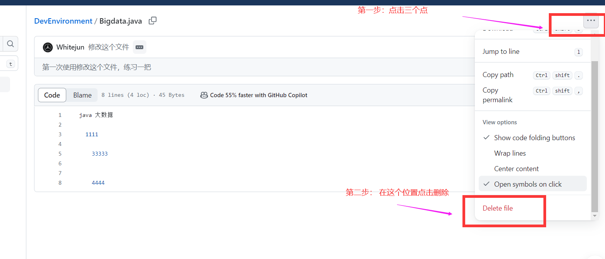

对应的删除后的文件怎么看的问题点儿：

点击进去，还收整个文件的变更的周期的记录


##### ④ 上传文件的按钮

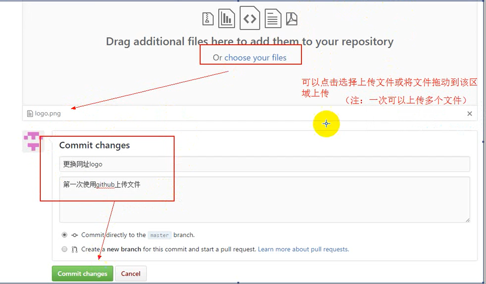


⑤ 

